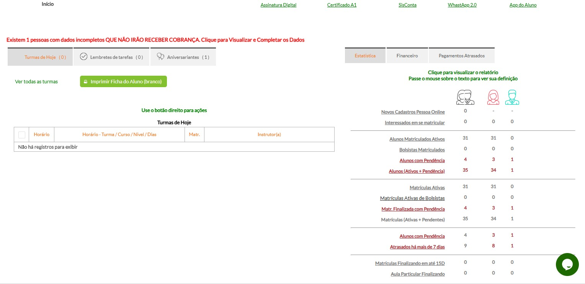
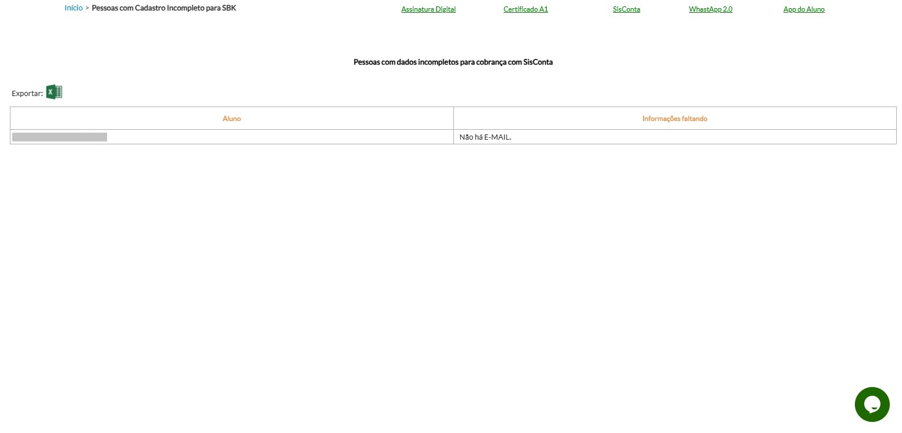
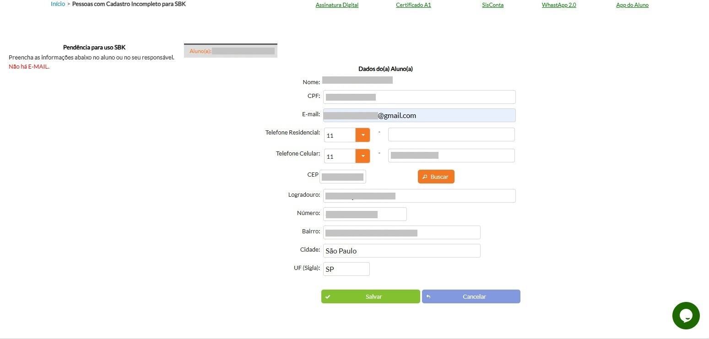

# 📊 Monitoramento do Sistema

## 📌 Objetivo

Documentar o acompanhamento realizado no sistema de gerenciamento de alunos, verificando seu funcionamento e identificando possíveis problemas durante sua utilização.

## 🔎 Atividades realizadas

O monitoramento envolvia o acompanhamento do funcionamento do sistema e a identificação de situações que poderiam afetar sua utilização.

### Atividades

* Acompanhamento do funcionamento do sistema;
* Verificação das funcionalidades;
* Identificação de problemas;
* Acompanhamento de possíveis erros;
* Realização de testes quando necessário;
* Verificação após a aplicação de correções.

## 🖼️ Demonstração

## 🔧 Resolução de problemas

Quando um problema era identificado, era realizada uma análise para entender sua causa e buscar uma solução adequada.

### 🖼️ Demonstração

## ✅ Resultado

O acompanhamento permitia identificar problemas e manter o sistema funcionando adequadamente para os usuários.

