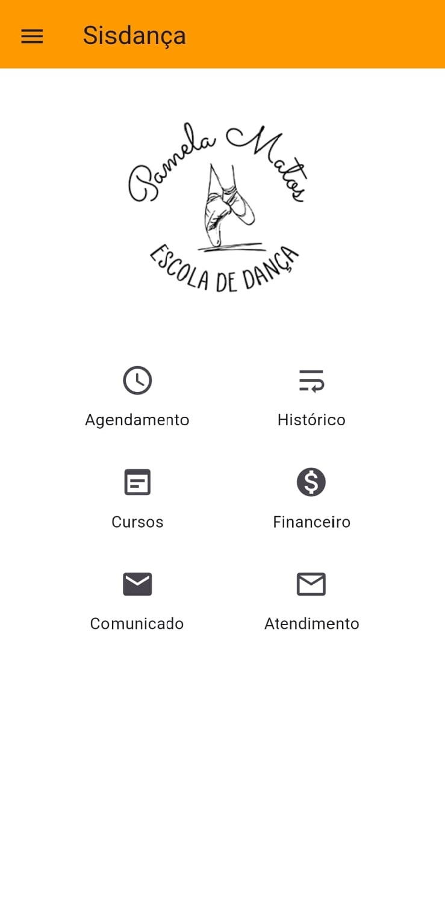

# 👥 Suporte aos Usuários

## 📌 Objetivo

Documentar o suporte prestado aos usuários durante a utilização do sistema de gerenciamento de alunos.

## 🛠️ Atividades realizadas

O suporte consistia em auxiliar os usuários na utilização do sistema e solucionar problemas encontrados durante as atividades.

### Atividades

* Orientação aos usuários;
* Auxílio na utilização das funcionalidades;
* Identificação de dificuldades;
* Resolução de problemas;
* Esclarecimento de dúvidas;
* Acompanhamento após a solução.

## 🔎 Processo de atendimento

Quando um usuário apresentava uma dificuldade, o problema era analisado para identificar a causa e determinar a melhor forma de solucioná-lo.

Após a solução, era realizada uma verificação para confirmar o funcionamento adequado.

### 🖼️ Demonstração- Aplicativo utilizado pelos usuários

## 📚 Competências desenvolvidas

* Suporte técnico;
* Atendimento ao usuário;
* Comunicação;
* Diagnóstico de problemas;
* Resolução de problemas;
* Organização de informações.

